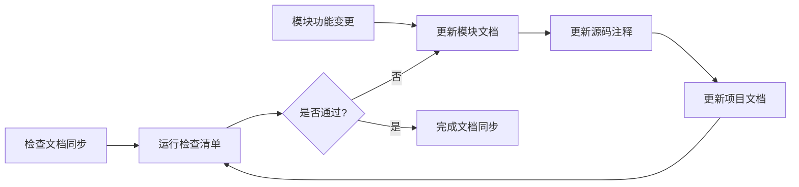

# 贡献指南

[](https://github.com/eframework-org/U3D.UTIL/graphs/contributors)
[](https://github.com/eframework-org/U3D.UTIL/graphs/commit-activity)
[](https://github.com/eframework-org/U3D.UTIL/commits/master)

[](https://github.com/eframework-org/U3D.UTIL/issues)
[](https://github.com/eframework-org/U3D.UTIL/actions/workflows/test.yml)
[](https://github.com/eframework-org/U3D.UTIL/actions/workflows/publish.yml)

感谢您考虑为本项目做出贡献！

## 技术路线

### 1. 开发语言
- C# 10.0+：主要开发语言
- 遵循 Unity C# 编码规范和最佳实践

### 2. 开发工具
- Unity 6000 LTS+：游戏引擎
- Unity Test Framework：单元测试框架
- Cursor/VS Code/Visual Studio：代码编辑器

### 3. 集成工具
- Github Action：提供了自动化测试及发布工作流
- Game CI：基于 unity-test-runner@v4 的测试环境

## 目录规范

### 1. 目录结构
```
<Root>/                                    # 项目目录
│
├── .github/                               # 工作流目录
│   └── workflows/*.yml                    # 工作流脚本
│
├── .puer/                                 # Puer模块目录
│
├── Editor/                                # 编辑器目录
│   ├── Scripts/                           # 编辑器脚本
│   │   ├── <Module1>.cs                   # 编辑器模块1实现
│   │   ├── <Module1>.Part02.cs            # 编辑器模块1实现2
│   │   ├── <Module2>.cs                   # 编辑器模块2实现
│   │   └── ...
│   │
│   └── Resources/                         # 编辑器资源
│
├── Runtime/                               # 运行时目录
│   ├── Scripts/                           # 运行时脚本
│   │   ├── <Module1>.cs                   # 运行时模块1实现
│   │   ├── <Module1>.Part02.cs            # 运行时模块2实现2
│   │   ├── <Module2>.cs                   # 运行时模块2实现
│   │   └── ...
│   │
│   └── Resources/                         # 运行时资源
│
├── Tests/                                 # 测试目录
│   ├── Editor/                            # 编辑器目录
│   │   ├── Scripts/                       # 编辑器脚本
│   │   │    ├── <Module1>.Test.cs         # 编辑器模块1测试
│   │   │    ├── <Module1>.Part02.Test.cs  # 编辑器模块1测试2
│   │   │    ├── <Module2>.Test.cs         # 编辑器模块2测试
│   │   │    └── ...
│   │   │
│   │   └── Resources/                     # 编辑器资源
│   │
│   │── Runtime/ # 运行时目录
│   │   ├── Scripts/                       # 运行时脚本
│   │   │    ├── <Module1>.Test.cs         # 运行时模块1测试
│   │   │    ├── <Module1>.Part02.Test.cs  # 运行时模块1测试2
│   │   │    └── ...
│   │   │
│   │   └── Resources/                     # 运行时资源
│
├── Samples~/                              # 示例目录
│   ├── Sample1/                           # 示例1目录
│   ├── Sample2/                           # 示例2目录
│   └── ...
│
├── Documentation~/                        # 文档目录
│   ├── <Module1>.md                       # 模块1文档
│   ├── <Module2>.md                       # 模块2文档
│   └── ...
│
├── README.md                              # 项目文档
├── CHANGELOG.md                           # 更新记录
├── CONTRIBUTING.md                        # 贡献指南
├── LICENSE.md                             # 开源协议
└── package.json                           # 项目描述
```

### 2. 命名规范

1. 目录命名
   - 使用 PascalCase 命名法，如：`Hello`、`World`、`Greet`
   - 专有目录使用通用命名规范，如：`.github`、`workflows`、`node_modules`
   - 遵循 [Unity Package Layout](https://docs.unity3d.com/Manual/cus-layout.html) 规范

2. 文件命名
   - 源代码文件使用 PascalCase 命名法，如：`Hello.cs`、`Hello.Part02.cs`、`Greet.Test.cs`
   - 资源文件使用 PascalCase 命名法，如：`Hello.unity`、`HelloWorld.prefab`
   - 专有文件使用通用命名规范，如：`README.md`、`.gitignore`

## 文档规范

### 1. 语言规范
- 首选语言：中文
- 专有名词保持原文，如：Node.js、TypeScript
- 中英文之间需要空格，如：Hello 你好

### 2. 标点规范
- 中文文档使用中文标点
- 代码示例使用英文标点

### 3. 格式规范
- 使用 Markdown 编写文档
- 标题使用 ATX 风格（#）
- 列表使用短横线（-）作为标记
- 代码块使用三个反引号（```）
- 文件末尾保留一个空行

### 4. 链接规范
- 使用相对路径链接项目内文件
- 使用完整 URL 链接外部资源
- 锚点使用小写，空格替换为连字符

### 5. 文档模板

#### 项目文档
文件路径：`<项目目录>/README.md`

```markdown
# <项目名称>

[](https://www.npmjs.com/package/<项目包名>)
[](https://www.npmjs.com/package/<项目包名>)
[](https://deepwiki.com/<项目包名>)

<项目名称> 提供了/是一个/实现了 <核心功能>，支持/用于 <主要特性>。

## 功能特性

- [<模块1名称>](Documentation~/<模块1名称>.md) <模块1简介>
- [<模块2名称>](Documentation~/<模块2名称>.md) <模块2简介>
- ...

## 常见问题

### 1. <问题描述>
<问题详情>

...

更多问题，请查阅[问题反馈](CONTRIBUTING.md#问题反馈)。

## 项目信息

- [更新记录](CHANGELOG.md)
- [贡献指南](CONTRIBUTING.md)
- [许可证](LICENSE.md)
```

#### 模块文档
文件路径：Documentation~/<模块名称>.md

```markdown
# <模块名称>

[](https://www.npmjs.com/package/<项目包名>)
[](https://www.npmjs.com/package/<项目包名>)
[](https://deepwiki.com/<项目包名>)

<模块名称> 提供了/是一个/实现了 <核心功能>，支持/用于 <主要特性>。

## 功能特性

- 支持/提供 XXX：具体说明
- 实现了 XXX：具体说明
- ...

## 使用手册

### 1. <功能类别1>

#### 1.1 <具体功能>
<功能说明和示例（参考测试用例编写）>

...

## 常见问题

### 1. <问题描述>
<问题详情>

...

更多问题，请查阅[问题反馈](../CONTRIBUTING.md#问题反馈)。

## 项目信息

- [更新记录](../CHANGELOG.md)
- [贡献指南](../CONTRIBUTING.md)
- [许可证](../LICENSE.md)
```

#### 模块注释
文件路径：<模块名称>.cs

```csharp
// Copyright (c) 2025 EFramework Organization. All rights reserved.
// Use of this source code is governed by a MIT-style
// license that can be found in the LICENSE file.

/// <summary>
/// <模块名称> 提供了/是一个/实现了 <核心功能>，支持/用于 <主要特性>。
/// </summary>
/// <remarks>
/// <code>
/// 功能特性
/// - <特性1>
/// - <特性2>
/// - ...
/// 
/// 使用手册
/// 1. <功能类别1>
/// 
/// 1.1 <具体功能>
/// 
/// 	<功能说明和示例（参考测试用例编写）>
/// 
/// ...
/// </code>
/// 更多信息请参考模块文档。
/// </remarks>
public class <模块名称> { }
```

### 6. 文档同步

#### 同步范围

##### 1. 项目级同步
- 项目信息（`<项目目录>/package.json`）的项目描述应与项目文档（`<项目目录>/README.md`）保持一致，以项目文档为准
- 项目文档（`<项目目录>/README.md`）功能特性章节中各模块的描述应与其文档（`Documentation~/<模块名称>.md`）保持一致，以模块文档为准

##### 2. 模块级同步
- 模块文档（`Documentation~/<模块名称>.md`）具有最高优先级，是模块的主要文档
- 模块源码（`<模块名称>.cs`）的注释应与模块文档保持一致，以模块文档为准
- 项目文档（`<项目目录>/README.md`）中的模块描述应与模块文档保持一致，以模块文档为准

##### 3. 功能级同步
- 文档功能描述更新
- 示例代码同步更新
- 功能使用说明补充

#### 检查清单

##### 1. 描述一致性
- [ ] 项目描述一致性
- [ ] 模块描述一致性

##### 2. 功能完整性
- [ ] 功能列表完整性
- [ ] 示例代码正确性

##### 3. 链接有效性
- [ ] 文档内部链接检查
- [ ] 外部资源链接检查

#### 同步流程



## 代码规范

### 1. 代码风格
- 使用 Visual Studio/VS Code 的格式化功能
- 使用 4 空格缩进（不转换为 tab）
- 遵循 Unity C# 编码规范
- 版权声明、类、函数之间及文件末尾保留一个空行

### 2. 命名规范
- 命名空间：使用 PascalCase + `.` 间隔，如：`Hello.World`
- 类名：使用 PascalCase，如：`Greet`
- 方法名：使用 PascalCase，如：`SayHello`
- 变量名：使用 camelCase，如：`helloMessage`
- 常量名：使用 PascalCase，如：`ServiceName`
- 属性名：使用 PascalCase，如：`IsClient`
- 事件名：使用 PascalCase，如：`OnUpdate`
- 接口名：使用 I 前缀 + PascalCase，如：`IBehaviour`

### 3. 注释规范

1. 基本要求
   - 使用 XML 文档注释格式，使用自然语句进行描述
   - 遵循[语言规范](#1-语言规范)和[标点规范](#2-标点规范)
   - 公开的类型和成员必须包含文档注释

2. 注释模板
   ```csharp
   // Copyright (c) 2025 EFramework Organization. All rights reserved.
   // Use of this source code is governed by a MIT-style
   // license that can be found in the LICENSE file.

   /// <summary>
   /// 定义了游戏对象的基础行为接口。
   /// 实现此接口的类型可以参与游戏交互。
   /// </summary>
   public interface IGameObject
   {
       /// <summary>
       /// 初始化游戏对象。
       /// </summary>
       void Initialize();

       /// <summary>
       /// 处理游戏对象的更新逻辑。
       /// </summary>
       /// <param name="deltaTime">上一帧到当前帧的时间间隔</param>
       void Update(float deltaTime);

       /// <summary>
       /// 销毁游戏对象时的清理操作。
       /// </summary>
       void OnDestroy();
   }

   /// <summary>
   /// 表示无效的游戏状态。
   /// </summary>
   public class InvalidGameStateException : Exception
   {
       public InvalidGameStateException(string message) : base(message) { }
   }
   ```

## 提交规范

### 1. 分支命名
- 功能分支：`feature/功能名称`
- 修复分支：`fix/问题描述`
- 优化分支：`optimize/优化内容`

### 2. 提交信息
- 遵循[语言规范](#1-语言规范)和[标点规范](#2-标点规范)
```
<类型>: <描述>

[可选的详细描述]

[可选的关闭问题]
```

- 类型包括：
  - `feat`: 新功能
  - `fix`: 修复问题
  - `docs`: 文档更新
  - `style`: 代码格式调整
  - `refactor`: 代码重构
  - `perf`: 性能优化
  - `test`: 测试相关
  - `chore`: 构建过程或辅助工具的变动

### 3. 提交模板
```
feat: 添加XX功能
- 添加了XX特性A
- 优化了XX流程B
- 更新相关文档
  
详细说明此功能的主要变更和影响范围
  
Closes #123
```

## 测试规范

### 1. 基本要求
- 核心功能必须有单元测试
- 保持较高的测试覆盖率

### 2. 代码模板
- 源码头部包含版权声明
- 源码主体使用 UNITY_INCLUDE_TESTS 宏定义包围
- 缺省命名空间，无需 namespace Xxx {}
- 函数名称使用 PascalCase 命名法，并简化用例名，无需以TestXxx开头

```csharp
// Copyright (c) 2025 EFramework Organization. All rights reserved.
// Use of this source code is governed by a MIT-style
// license that can be found in the LICENSE file.

#if UNITY_INCLUDE_TESTS
using System;
using NUnit.Framework;
using <模块所在命名空间>;

public class Test<模块名称>
{
   [Test]
   public void <功能1>()
   {
      // 准备测试数据（Arrange）

      // 执行测试功能（Act）

      // 验证测试结果（Assert）
   }
   ...
}
#endif
```

## 开发流程

### 1. 环境准备
- 克隆解决方案仓库：`git clone https://github.com/eframework-org/U3D.git`
- 使用 `Cursor` 或 `VS Code` 编辑器打开解决方案

### 2. 开发调试
- 在编辑器中运行 `Open in Unity` 任务以打开 Unity 工程
- 在编辑器中运行 `Attach to Unity` 任务以调试 Unity 工程
- 在编辑器中运行 `Test in Unity` 任务以测试 Unity 工程

## 发布流程

### 1. 运行单元测试
- 使用 `Unity Test Runner` 运行所有单元测试
- 确保 `EditMode` 和 `PlayMode` 模式测试通过

### 2. 检查文档同步
- 按照[文档模板](#5-文档模板)检查单个文档是否符合规范
- 按照[文档同步](#6-文档同步)检查关联文档之间是否同步

### 3. 更新修改记录
- 使用年月日格式：`YYYY-MM-DD`
- 按版本号降序排列
- 分类记录变更内容：
  ```markdown
  ## [1.0.0] - 2024-03-21
  ### 新增
  - 添加了新功能 A
  - 添加了新功能 B
  
  ### 优化
  - 优化了功能 C 的性能
  - 改进了功能 D 的用户体验
  
  ### 修复
  - 修复了问题 E
  - 修复了问题 F
  
  ### 变更
  - 调整了配置项 G
  - 更新了依赖库版本
  ```

### 4. 发布至注册表
- 确定版本：遵循[语义化版本 2.0.0](https://semver.org/lang/zh-CN/)
- 发布版本：运行[版本发布](https://github.com/eframework-org/U3D.UTIL/actions/workflows/publish.yml)工作流

## 问题反馈

### 1. 问题检索
- 查阅[议题](https://github.com/eframework-org/U3D.UTIL/issues)避免重复
- 确认可以稳定重现
- 提供必要环境信息

### 2. 问题报告
```markdown
### 问题描述
[清晰简洁的问题描述]

### 重现步骤
1. [步骤1]
2. [步骤2]
3. [步骤3]

### 期望行为
[描述期望的结果]

### 实际行为
[描述实际的结果]

### 环境信息
- Unity 版本：如 6000.0.32f1
- 操作系统：如 Windows 11
- 依赖版本：如 1.0.0
```

## 许可证

通过提交代码，您同意将您的代码贡献置于 MIT [许可证](LICENSE)之下。
